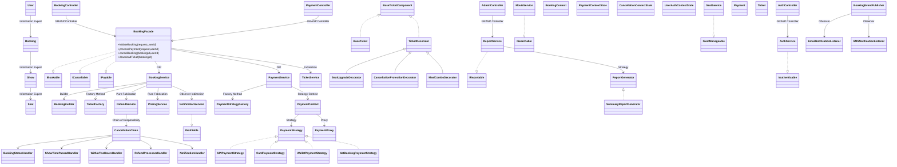

# CineBook OOAD Class Diagram

```mermaid
classDiagram
    class BookingController
    class PaymentController
    class AdminController
    class AuthController

    class BookingFacade {
      +initiateBooking(request,userId)
      +processPayment(request,userId)
      +cancelBooking(bookingId,userId)
      +downloadTicket(bookingId)
    }

    class BookingService
    class PaymentService
    class NotificationService
    class PricingService
    class RefundService
    class SeatService
    class ReportService
    class TicketService

    class BookingBuilder
    class CancellationChain
    class PaymentStrategyFactory
    class PaymentProxy
    class TicketFactory
    class BookingEventPublisher

    class PaymentStrategy
    class UPIPaymentStrategy
    class CardPaymentStrategy
    class WalletPaymentStrategy
    class NetBankingPaymentStrategy

    class ReportGenerator
    class SummaryReportGenerator

    class BookingContext
    class PaymentContextState
    class CancellationContextState
    class UserAuthContextState

    class Booking
    class Show
    class Seat
    class User
    class Payment
    class Ticket

    class BaseTicketComponent
    class BaseTicket
    class TicketDecorator
    class SeatUpgradeDecorator
    class CancellationProtectionDecorator
    class MealComboDecorator

    class IBookable
    class ICancellable
    class IPayable
    class INotifiable
    class IReportable
    class ISearchable
    class IAuthenticable
    class ISeatManageable

    BookingController --> BookingFacade : GRASP Controller
    PaymentController --> BookingFacade : GRASP Controller
    AuthController --> AuthService : GRASP Controller
    AdminController --> ReportService : GRASP Controller

    BookingFacade ..|> IBookable
    BookingFacade ..|> ICancellable
    BookingFacade ..|> IPayable

    NotificationService ..|> INotifiable
    ReportService ..|> IReportable
    MovieService ..|> ISearchable
    AuthService ..|> IAuthenticable
    SeatService ..|> ISeatManageable

    BookingFacade --> BookingService : DIP
    BookingFacade --> PaymentService : DIP
    BookingFacade --> TicketService : Indirection

    BookingService --> BookingBuilder : Builder
    BookingService --> TicketFactory : Factory Method
    BookingService --> RefundService : Pure Fabrication
    BookingService --> PricingService : Pure Fabrication
    BookingService --> NotificationService : Observer Indirection

    RefundService --> CancellationChain : Chain of Responsibility
    CancellationChain --> BookingStatusHandler
    CancellationChain --> ShowTimePassedHandler
    CancellationChain --> WithinTwoHoursHandler
    CancellationChain --> RefundProcessorHandler
    CancellationChain --> NotificationHandler

    PaymentService --> PaymentStrategyFactory : Factory Method
    PaymentService --> PaymentContext : Strategy Context
    PaymentContext --> PaymentStrategy : Strategy
    PaymentContext --> PaymentProxy : Proxy
    PaymentStrategy <|.. UPIPaymentStrategy
    PaymentStrategy <|.. CardPaymentStrategy
    PaymentStrategy <|.. WalletPaymentStrategy
    PaymentStrategy <|.. NetBankingPaymentStrategy

    BookingEventPublisher --> EmailNotificationListener : Observer
    BookingEventPublisher --> SMSNotificationListener : Observer

    ReportService --> ReportGenerator : Strategy
    ReportGenerator <|.. SummaryReportGenerator

    BaseTicketComponent <|.. BaseTicket
    BaseTicketComponent <|.. TicketDecorator
    TicketDecorator <|-- SeatUpgradeDecorator
    TicketDecorator <|-- CancellationProtectionDecorator
    TicketDecorator <|-- MealComboDecorator

    Booking --> Show : Information Expert
    Show --> Seat : Information Expert
    User --> Booking : Information Expert
```
